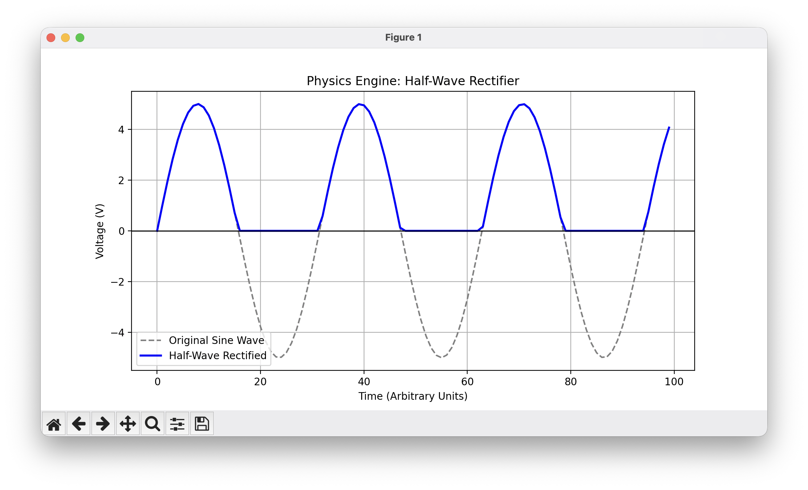

# High-Performance Physics & Circuit Engine

A software tool designed to model electronic behaviors and automate experimental data analysis. This project demonstrates hardware-software co-design by pairing a high-performance C backend for mathematical computation with a Python frontend for data visualization and user interaction.

## Architecture

*   **Backend (C):** Handles the heavy computational lifting. It includes algorithms to simulate hardware components like half-wave rectifiers, full-wave rectifiers, clippers, and clampers over arrays of continuous data.
*   **Integration (`ctypes`):** Acts as the bridge, passing memory pointers and data arrays directly between Python and the compiled C dynamic library.
*   **Frontend (Python & Matplotlib):** Programmatically generates input waveforms, interfaces with the C engine, and graphs the resulting experimental curves to visualize the simulated electronic behaviors.

## Visual Output
*(A visualization of a mathematical sine wave processed through the C half-wave rectifier algorithm)*



## Tech Stack
*   **C** (Systems logic and array manipulation)
*   **Python** (Scripting and automation)
*   **ctypes** (Foreign function interface)
*   **Matplotlib** (Data visualization)

## How to Run (macOS)

1. **Clone the repository:**
   ```bash
   git clone [https://github.com/Hansal001/circuit_engine.git](https://github.com/Hansal001/circuit_engine.git)

